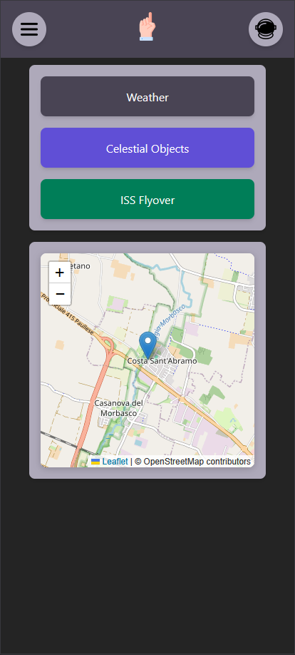

# 🎨 Above You — Frontend

## 🌌 Overview
Minimal frontend offering an intuitive and responsive user experience.

## 🏗️ Tech Stack
- Vue.js
- Leaflet
- TailwindCSS

## 👁️ Current Interface Preview  

## 🧱 Interface Core Sections (Components)
- **Header/Navbar** – Displays app title and navigation.
- **Main Dashboard** – The primary section showing all real-time data.
    - **Weather Conditions** (temperature, cloud cover, visibility).
    - **Celestial Objects** (retrieved from NASA API).
    - **ISS Flyover Times** (when ISS will be visible).
- **Dark Mode Toggle** – Switch between light and dark themes for better usability.
- **Location Selector** – If users can check sky conditions elsewhere.
- **Login Modal/Popup** – If user authentication is added later.

## 🗺️ Map & Geolocation Handling
- Uses Leaflet.js to display the user’s location.
- Implements OSM Reverse Geocoding through a backend proxy.
- Uses navigator.geolocation.watchPosition() for real-time tracking.
- Frontend caching to reduce API calls, using the Haversine Formula